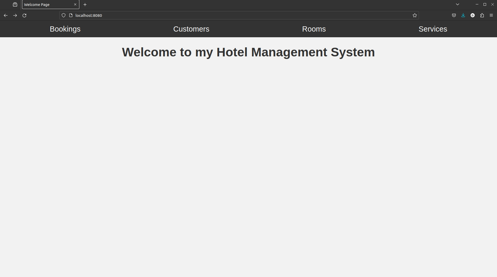
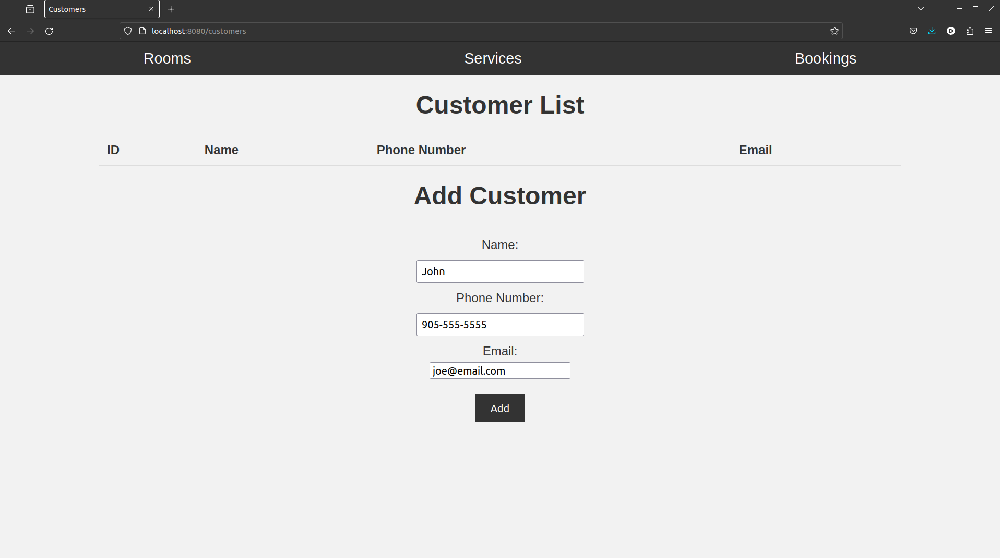
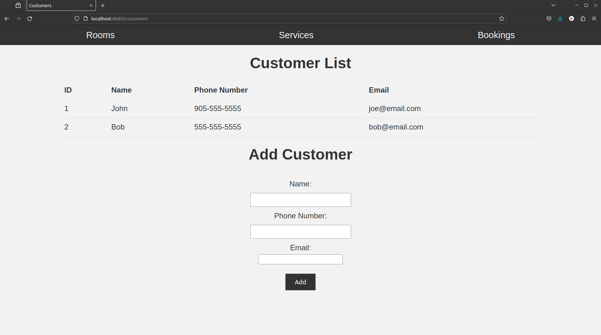
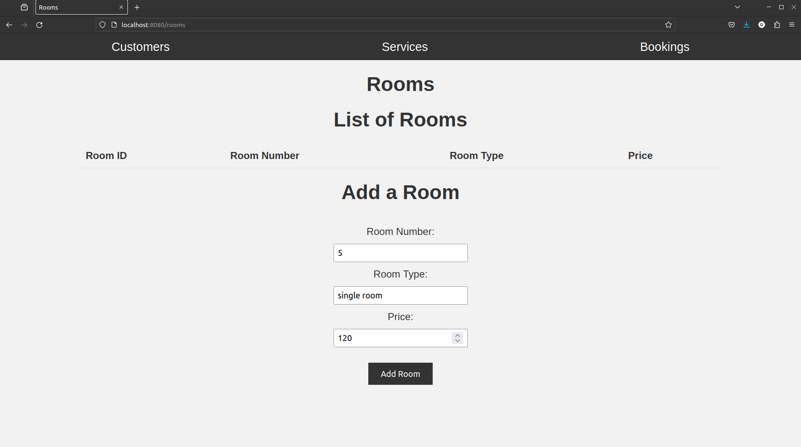
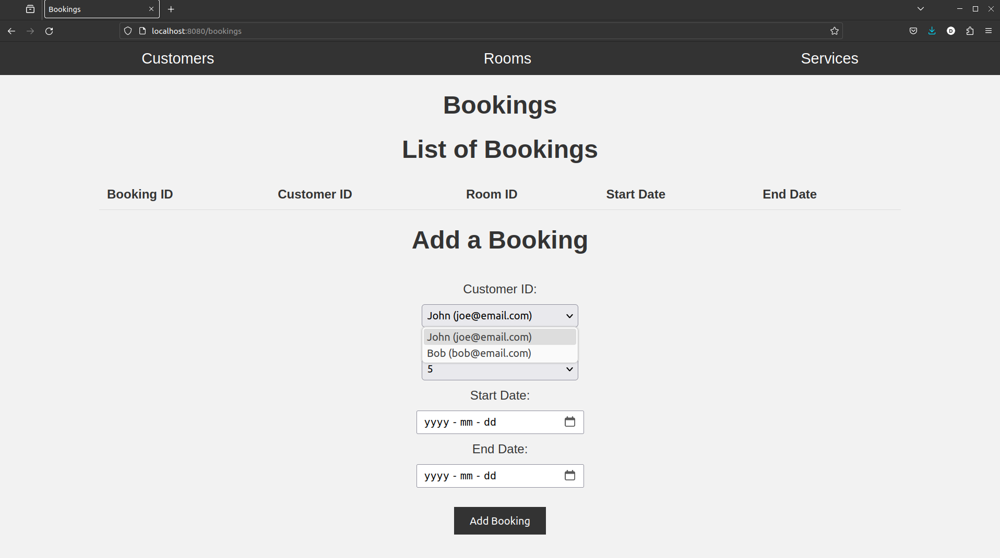
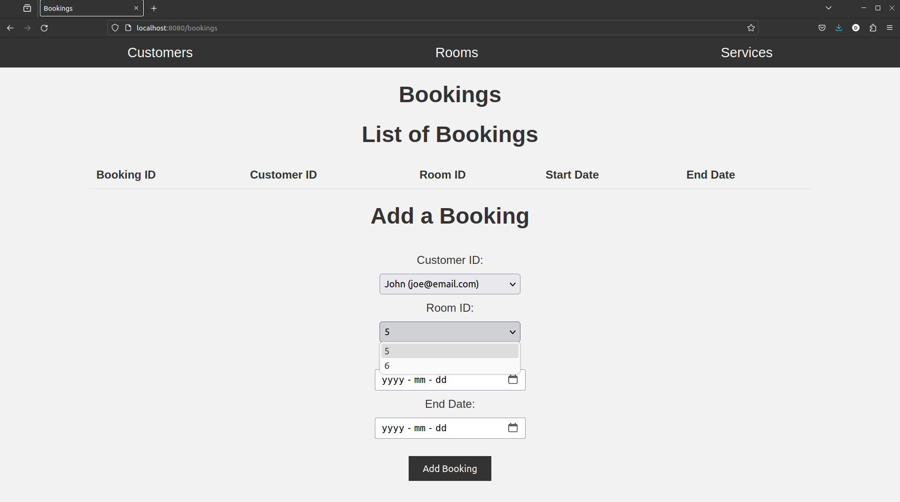
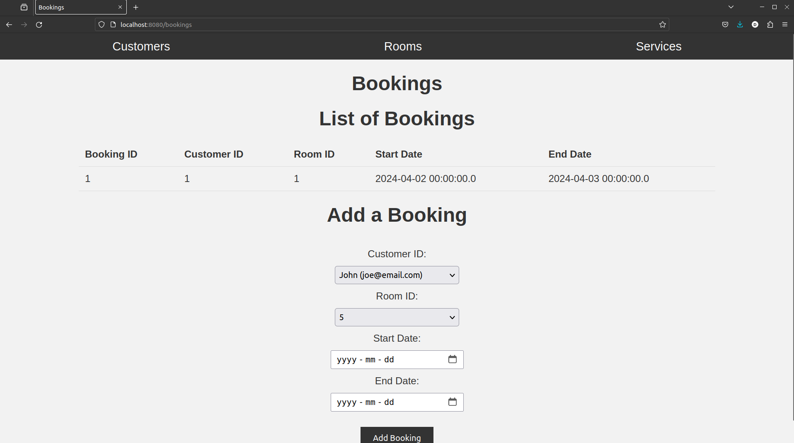
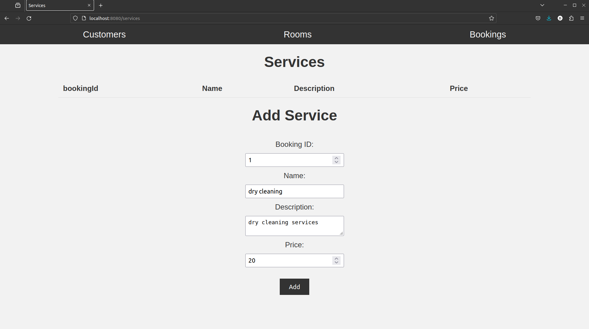

# Hotel Management Project

This is a project for managing a hotel.

## Screenshots

Homepage

Customers

Room

Booking page, note the customer name and room number map onto the customer ID and room ID in the code and are used instead for the users convenience.

An email is as unique as a customer ID, but easier for the user to distinguish/remember. And room numbers are as unique as a room ID, but easier to remember.

The dropdown menus contain a list of every customer and room that has been added so far.

Services

## Installation

1. Clone the repository.
2. Run `mvn package`

## Usage

1. Run the jar file that was generated from the last step.
   `java -jar ./target/hotel-manag-0.0.1-SNAPSHOT.jar`
   Or
   `mvn spring-boot:run`
2. Open your browser and navigate to `localhost:8080`.
